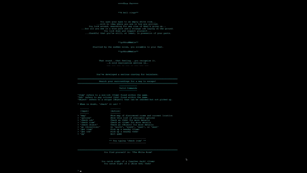

# The Craving

_A short, text-based, adventure game - with an animated dungeon map_

Welcome to TheCraving!

The game will take you through a short series of "escape the room" scenarios
which are navigated by entering commands - e.g. `go north`. This is the first
game that I have ever built, so please pardon the simplicity and lack of story
depth. I had developed this as a fun way to test my [python] programming
skills.

I truly appreciate all of you who take the time to play through the game. Any
and all feedback is _greatly_ appreciated. If you like the game, or at least
find it interesting, please share it with a friend and look for more projects
to follow!
***

## Requirements:

1. _**Python [3.9]**_: Can be downloaded [here](https://www.python.org/).
1. _**Pygame**_: Installable via pip or downloaded [here](https://www.pygame.org/).

Older versions of python may work; however, this has not been tested.
***

## Instructions:

This game is intended to be run from the CLI. Once the necessary requirements
are installed (python and pygame), simply download the package and run
`.\src\thecraving.py` from the package directory.

**\*\*NOTE\*\*** \
_Users may need to run `python .\src\thecraving.py` depending on their config._

*Be sure to resize your window, or scroll up, upon starting the game!*\
Please make use of the in-game command `options` to view commands!\
Please make use of the in-game command `map` to view your current
location on the dungeon map! **HIGHLY RECOMMENDED**
***

For the most recent developments, please see branch [POLISH](https://github.com/Celshade/TheCraving/tree/polish).

Found a bug or care to drop some feedback? See the link below! \
_Comments & bugs -> https://www.github.com/Celshade/TheCraving/issues_

Peace

**//Cel**
